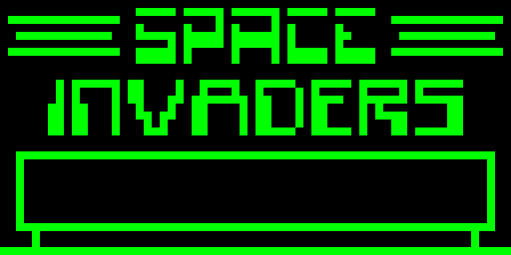
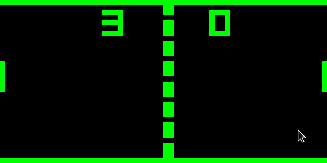
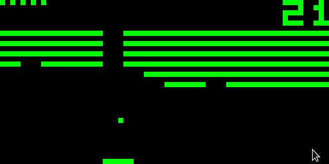

# Chippy


## Showcase
### Space Invaders

### Pong

### Breakout


## Build instructions
### Linux (GCC/Clang)
- Install SDL2 (https://www.libsdl.org/download-2.0.php)
- Run `make` in the root directory of the project

## Usage
### Loading a game
`./chippy <path to chip8 rom>`
### Playing a game
The chip8 has a 16-key keypad labelled
with hexadecimal numbers 0-F:
```
|1|2|3|C|
|4|5|6|D|
|7|8|9|E|
|A|0|B|F|
```
These are mapped to this block of keys on modern keyboard layouts:
```
|1|2|3|4|
 |Q|W|E|R|
  |A|S|D|F|
   |Z|X|C|V|
```
See roms/chip8.txt for details on each game, controls etc.

### Configuring the emulator
Modifiable values are defined as constants in src/chippy.h,
please note that any value for `CLOCK_RATE` above 1000 will make the
emulator run as fast as possible and that, while the window resolution
can be any number, multiples of 32 for `WINDOW_HEIGHT` and 64 for
`WINDOW_WIDTH` work best since the CHIP8's screen is 64x32.
The default window resolution is 640x320.

## Uninstalling
- Run `make clean` in the root directory of the project

# Acknowledgements
[Cowgod's CHIP8 technical reference](http://devernay.free.fr/hacks/chip8/C8TECH10.HTM)

[Wikipedia CHIP8 article](https://en.wikipedia.org/wiki/CHIP-8)

[SDL2](https://www.libsdl.org/)
